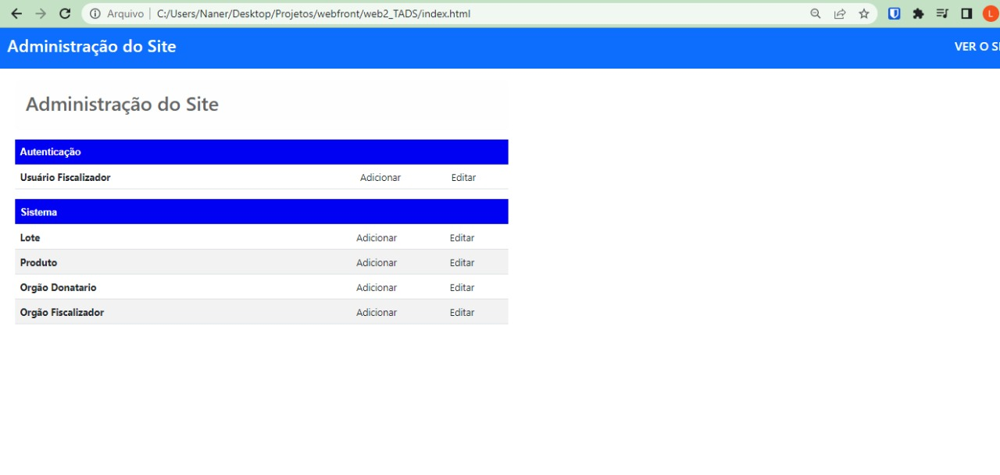

# Front-End do SemFraude

A aplicação SemFraude foi desenvolvida com o intuito de disponibilizar para que pessoas comuns possam ver quais produtos foram doados às instituições que possuem algum bazar. Assim consultas se existe algum produto que lhe interesse.

Esse README mostra somente a parte do fronte-end

## Como foi feito?

O front-end da atividade foi desenvolvida com Bootstrap, utilizando também html-css-js, para requisições para consumir a API iremos usar Ajax do Jquery.


O back-end do front foi desenvolvido em Python Django.


## Gerar Secret Key do django
```
echo "export SECRET_KEY='$(openssl rand -hex 40)'" > .DJANGO_SECRET_KEY
source .DJANGO_SECRET_KEY
```
## Requisitos da página do administrador
- [x] Página inicial do administrador
- [ ] Página para criar usuários
- [ ] Página para criar usuários

## Requisitos da página do cliente
- [ ] Página para visualização dos produtos e para onde eles vão


## Página inicial do administrador



## License

MIT

**Free Software**